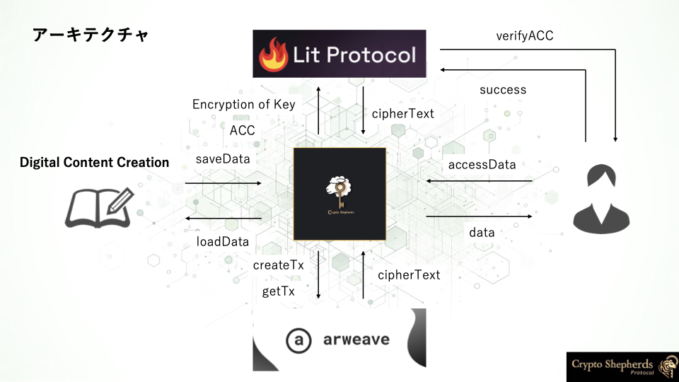
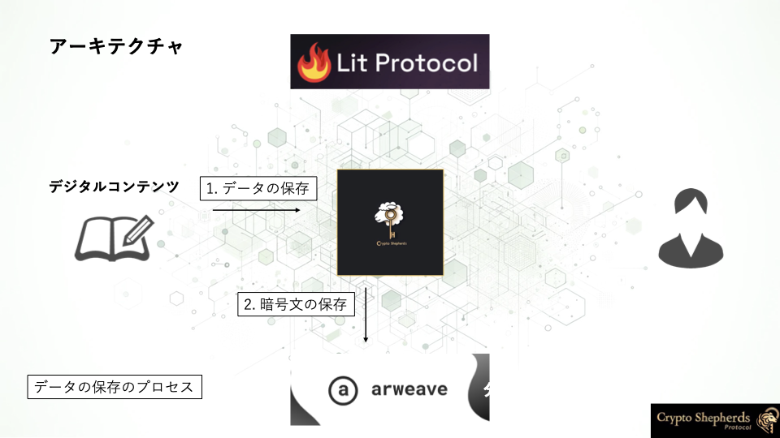
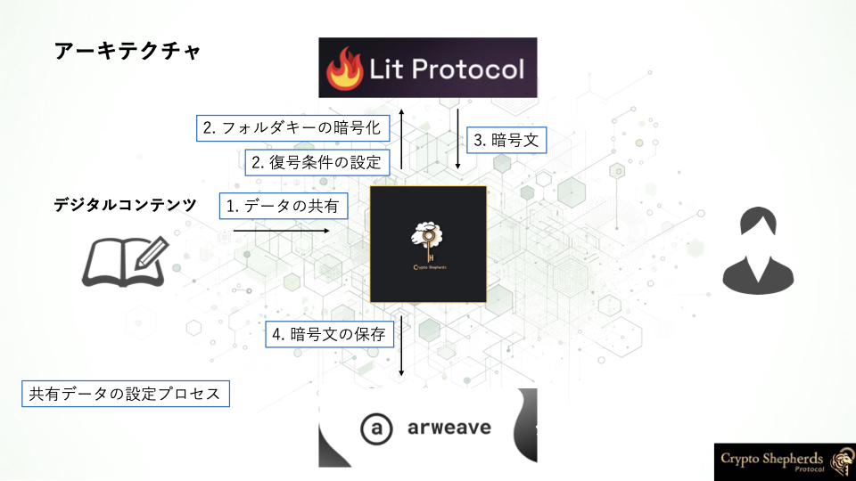
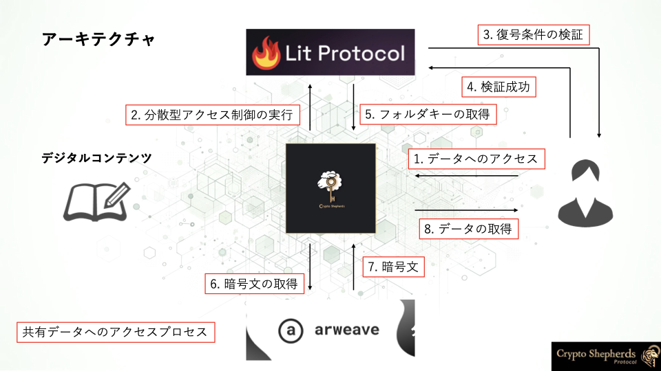

# Architecture

このセクションでは、CryptoShepherds Protocolのアーキテクチャについて説明します。

## アーキテクチャの目的
CryptoShepherds Protocolは、**単一のデータのアクセス制御だけでそれに紐づくすべてのデータを共有すること**と、**分散型ストレージに暗号化したデータを構造的に保存すること**を両方実現することで、分散型のデータ制御のスケーラビリティを高めます。

そのために、CryptoShepherds Protocolは、[対称鍵ベースの階層的な暗号化構造](./folder-encryption.md)により、単一の暗号化キーに関連データを紐づけて、暗号文を[arweave](https://www.arweave.org/)に保存し、共有するデータまたはフォルダに対して[Lit Protocol](https://litprotocol.com/)を使用することで、分散型のアクセス制御を実現します。

ここからは、CryptoShepherds Protocolのアーキテクチャについて詳しく説明します。

[CryptoShepherds Protocolの6つのメソッド](../quick-start/basic-usage.md)が提供している機能（プロセス）を、アーキテクチャの観点から説明します。

## データの保存

`createFolder`メソッドを使用してフォルダを作成し、`saveData`メソッドを使用してデータを保存すると、フォルダに紐づくデータは、[対称鍵ベースの階層的な暗号化構造](./folder-encryption.md)により、暗号化されてarweaveに保存されます。

## データの取得

`loadData`メソッドを使用してデータを取得すると、フォルダに紐づくデータは[対称鍵ベースの階層的な暗号化構造](./folder-encryption.md)により、arweaveから取得されデコードされます。

## 共有データの設定

`setShareFolder`メソッドや、`setSharedData`メソッドを使用して、フォルダに紐づくデータを共有するデータを設定すると、フォルダに紐づくデータは、[Lit Protocol](https://litprotocol.com/)を使用して、分散型のアクセス制御が実現されます。

## 共有データへのアクセス

`accessData`メソッドを使用して、共有データにアクセスすると、フォルダに紐づくデータは、[Lit Protocol](https://litprotocol.com/)を使用して、分散型のアクセス制御が実現されます。

