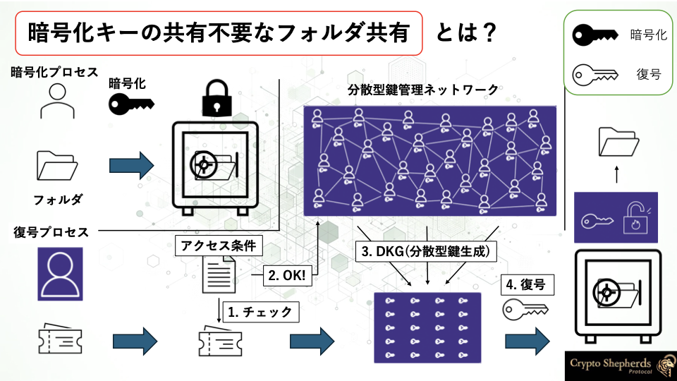
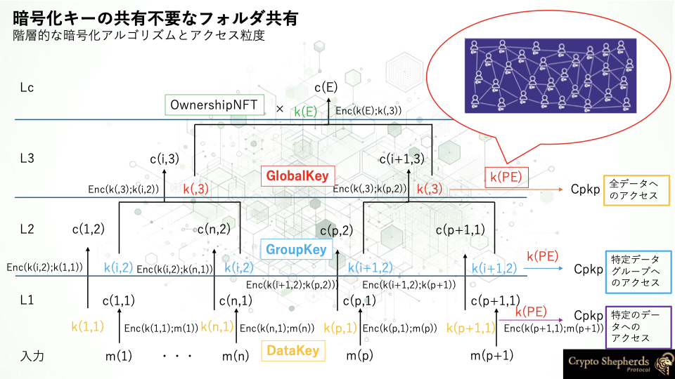
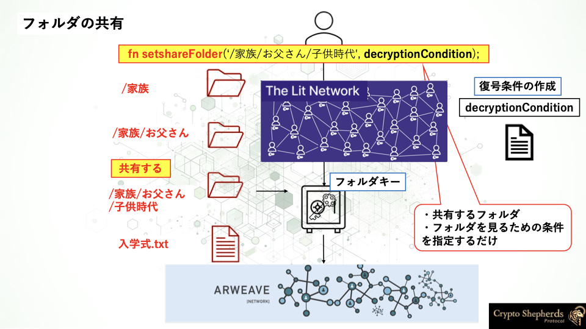
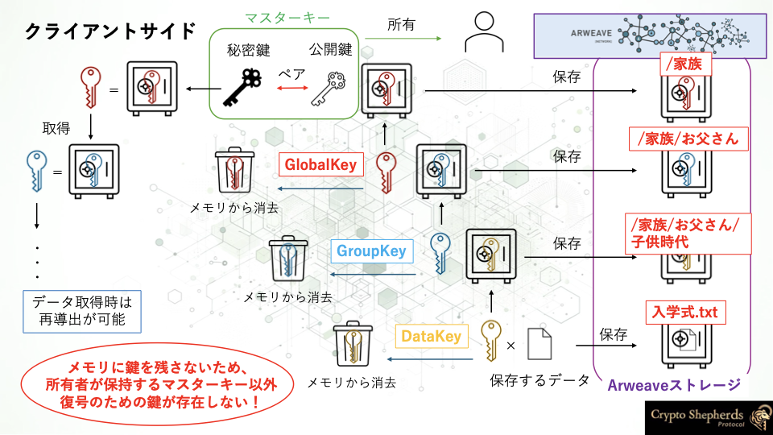

# Data Sharing

[Hierarchical Encryption](./folder-encryption.md)セクションでは、対称鍵をベースとした階層的暗号化構造により、分散型ストレージ(Arweave)に対称鍵をベースとした暗号文によるフォルダ構造を作成することができました

このセクションでは、このフォルダ構造を用いて、データの共有を行う方法を説明します。

## How it works

暗号化キーの共有不要なフォルダ共有とは、アクセス制御条件を満たしたユーザーに対して、完全なフォルダの暗号化キーを共有することなく、フォルダのデータにアクセスすることができるようにすることです。

このプロセスでは、複数のノードでアクセス制御条件の検証を行い、アクセス制御条件を満たしたユーザーに対して、どのように復号のための鍵を提供しているかに関して、概要を説明します。

### 分散型鍵生成のアルゴリズム

復号のための鍵を分散型鍵生成のアルゴリズムにより生成し、その鍵を用いてデータを復号を実行することができます。その際、どのノードも完全な鍵を持つことはありません。

分散型鍵生成のアルゴリズムについて、主にShamir's Secret Sharing (SSS)に基づく(k,n)閾値秘密分散法を中心に説明します。

1. アルゴリズムの概要
   - 秘密鍵sを生成し、nつのシェアに分散します。
   - k個以上のシェアがあれば秘密鍵sを復元できますが、k-1個以下では何の情報も得られません。

2. 鍵生成プロセス
   1. 秘密鍵sを選択します（通常は大きな素数体上の要素）。
   2. k-1次の多項式f(x)をランダムに生成します
    
        f(x) = s + a_1x + a_2x^2 + ... + a_(k-1)x^(k-1) mod p
        
        ここでpは大きな素数、a_1, ..., a_(k-1)はランダムに選ばれた係数です。
   3. n個のシェアを生成します

      (i, f(i)) for i = 1, 2, ..., n

3. 鍵の復元
   - k個以上のシェアを集めて、ラグランジュ補間法を使用して多項式f(x)を再構築します。
   - f(0)が秘密鍵sとなります。

このアルゴリズムにより、k-1個以下のシェアからは、秘密鍵sに関する情報を得ることができません。




### CryptoShepherds Protocolにおけるフォルダ共有

CryptoShepherds Protocolにおけるフォルダ共有は、この分散型鍵生成アルゴリズムを用いた復号をフォルダに対応した対称鍵に対して適用することで、フォルダに対しての分散型アクセス制御を実現します。




## 基本的なコンセプト

基本的なコンセプトは、以下の3つを実現することです。

1. [階層的暗号化構造の復号](./folder-encryption.md)プロセスにより、フォルダに対応した対称鍵を復号する
2. [Lit Protocol](https://litprotocol.com/)によりフォルダに対応した対称鍵に復号条件を設定し暗号化して、暗号文を分散型ストレージ(Arweave)に保存する
3. 分散型ストレージ(Arweave)に保存された暗号文を取得し、`accessData`メソッドを実行したユーザーが復号条件を満たした場合、分散型鍵生成のアルゴリズムにより、フォルダに対応した対称鍵を復号する

実際にCryptoShepherds Protocolのメソッドを対応させながら、ロジックを簡単に見ていきましょう。

[Hierarchical Encryption](./folder-encryption.md)セクションでは、`/家族/お父さん/子供時代`フォルダに、`入学式.jpg`というデータを保存しました。

ここでは、`/家族/お父さん/子供時代`フォルダの共有を考えます。

```javascript
setShareFolder('/家族/お父さん/子供時代', decryptCondition);
```

このメソッドを実行することで、`/家族/お父さん/子供時代`フォルダに対応した対称鍵に復号条件を設定し、暗号化して、分散型ストレージ(Arweave)に保存されます。



この際、暗号化される対称鍵は、分散型ストレージ(Arweave)から取得して、一度復号してから、再度暗号化する必要があります。

このプロセスは[Hierarchical Encryption](./folder-encryption.md)セクションで説明した通り、分散型ストレージ(Arweave)からフォルダに対応した暗号文を取得して、ルートの秘密鍵から順に復号していくことで、フォルダに対応した暗号化されていない対称鍵を取得することができます。




これで、共有するフォルダの設定を行うことができました。

次に、この`/家族/お父さん/子供時代`フォルダにアクセスして、`入学式.jpg`を取得するケースを考えます。

```javascript
accessData('/家族/お父さん/子供時代', '入学式.jpg');
```

このメソッドを実行することで、`/家族/お父さん/子供時代`フォルダに対応した暗号化された対称鍵を分散型ストレージ(Arweave)から取得して、`setShareFolder`メソッドで設定した復号条件`decryptCondition`をLit Networkにより検証し、成功した場合に、`/家族/お父さん/子供時代`フォルダに対応した対称鍵を復号して、`/家族/お父さん/子供時代`をルートとして配下の`入学式.jpg`に対応した暗号文を分散型ストレージ(Arweave)から取得することで、`入学式.jpg`を取得することができます。


## 具体的なロジック


では、より一般化してロジックを見てみましょう。


```jsx
import CryptoShepherds from 'cryptoshepherds-sdk';

const cs = new CryptoShepherds();

// 共有するフォルダの復号条件を設定
cs.setShareFolder('/path/to/folder', decryptionCondition);
// 共有するファイルの復号条件を設定
cs.setShareData('/path/to/folder', 'filename', decryptionCondition);
// 共有相手がファイルにアクセスするときに実行
cs.accessData('/path/to/folder', 'filename');
```

まずは、「共有するフォルダの復号条件を設定」に関してです。

```jsx
// 共有するフォルダの復号条件を設定
cs.setShareFolder('/a/b/p', decryptionCondition);
```

`setShareFolder`関数の役割は、`GROUP_KEY`または`GLOBAL_KEY`に「対称鍵の暗号化と、LitActionsを用いたその復号」ロジックを付与することです。当然、`setShareFolder`関数を実行するのは、データの保有者です。

`/a/b/p` フォルダを共有する場合

1. まずは、復号された`/a/b/p` に対応する`GROUP_KEY`が必要なので、
    1. txId(Tags: name: “GLOBAL”, value: `/a`)でC(GLOBAL_KEY(`/a`))を取得
        
        Dec(`秘密鍵` ;C(GLOBAL_KEY(`/a`)) → GLOBAL_KEY(`/a`))
        
    2. txId（Tags: name: “GROUP”, value: `/a/b`）でC(GROUP_KEY(`/a/b`))を取得
        
        Dec(GLOBAL_KEY(`/a`) ;C(GROUP_KEY(`/a/b`))) → GROUP_KEY(`/a/b`)
        
    3. txId（Tags: name: “GROUP”, value: `/a/b/p`）でC(GROUP_KEY(`/a/b/p`))を取得 
        
        Dec(GROUP_KEY(`/a/b`) ;C(GROUP_KEY(`/a/b/p`))) → GROUP_KEY(`/a/b/p`)
        
    
    を実行し、GROUP_KEY(`/a/b/p`)を取得します。
    
2. 次に、「対称鍵の暗号化と、LitActionsを用いたその復号/暗号化」プロセスにより、GROUP_KEY(`/a/b/p`)を暗号化し、復号条件を付与する。

`a/b/p` フォルダの`data`(`fileB`)を共有する場合

```jsx
// 共有するファイルの復号条件を設定
cs.setShareData('/a/b/p', 'fileB', decryptionCondition);
```

1. まずは、復号された`fileB` に対応するDATA_KEYが必要なので、
    1. txId(Tags: name: “GLOBAL”, value: `/a`)でC(GLOBAL_KEY(`/a`))を取得
        
        Dec(`秘密鍵` ;C(GLOBAL_KEY(`/a`)) → GLOBAL_KEY(`/a`))
        
    2. txId（Tags: name: “GROUP”, value: `/a/b`）でC(GROUP_KEY(`/a/b`))を取得
        
        Dec(GLOBAL_KEY(`/a`) ;C(GROUP_KEY(`/a/b`))) → GROUP_KEY(`/a/b`)
        
    3. txId（Tags: name: “GROUP”, value: `/a/b/p`）でC(GROUP_KEY(`/a/b/p`))を取得 
        
        Dec(GROUP_KEY(`/a/b`) ;C(GROUP_KEY(`/a/b/p`))) → GROUP_KEY(`/a/b/p`)
        
    4. txId（Tags: name: “DATA_KEY”, value: `fileB`）でC(DATA_KEY(`fileB`))を取得 
        
        Dec(GROUP_KEY(`/a/b/p`) ;C(DATA_KEY(`fileB`))) → DATA_KEY(`fileB`)
        
2. 次に、「対称鍵の暗号化と、LitActionsを用いたその復号/暗号化」プロセスにより、DATA_KEY(`fileB`)を暗号化し、復号条件を付与する。

`/a/b/p` フォルダを共有された場合に、`/a/b/p` フォルダの`data` (`fileB`)にアクセスする場合

```jsx
// 共有相手がファイルにアクセスするときに実行
cs.accessData('/a/b/p', 'filename');
```

1. accessData関数を実行する
2. 「対称鍵の暗号化と、LitActionsを用いたその復号/復号」プロセスにより、GROUP_KEY(`/a/b/p`)を取得
3. txId（Tags: name: “DATA_KEY”, value: `fileB`）でC(DATA_KEY(`fileB`))を取得 
    
    Dec(GROUP_KEY(`/a/b/p`) ;C(DATA_KEY(`fileB`))) → DATA_KEY(`fileB`)
    
4. txId（Tags: name: “RAW_DATA”, value: `fileB`）でC(`data`)を取得 
    
    Dec(DATA_KEY(`fileB`) ;C(`data`)) → `data` (`fileB`)
    

フォルダ（`GROUP_KEY`）を共有された場合は、パスに沿って配下の`GROUP_KEY`, `DATA_KEY`を復号して、その後、`RAW_DATA`を復号すれば、共有されたフォルダ配下の任意のフォルダのデータにアクセスできる

`a/b/p` フォルダの`data` (`fileB`)を共有された場合に、`/a/b/p` フォルダの`data` (`fileB`)にアクセスする場合

```jsx
// 共有相手がファイルにアクセスするときに実行
cs.accessData('/a/b/p', 'filename');
```

1. accessData関数を実行する
2. 「対称鍵の暗号化と、LitActionsを用いたその復号/復号」プロセスにより、DATA_KEY(`fileB`)を取得
3. txId（Tags: name: “RAW_DATA”, value: `fileB`）でC(`data`)を取得 
    
    Dec(DATA_KEY(`fileB`) ;C(`data`)) → `data`(`fileB`)
