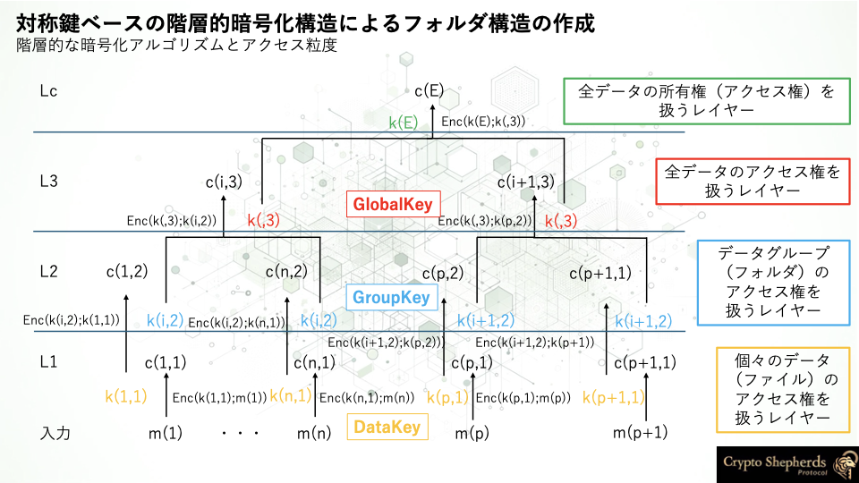
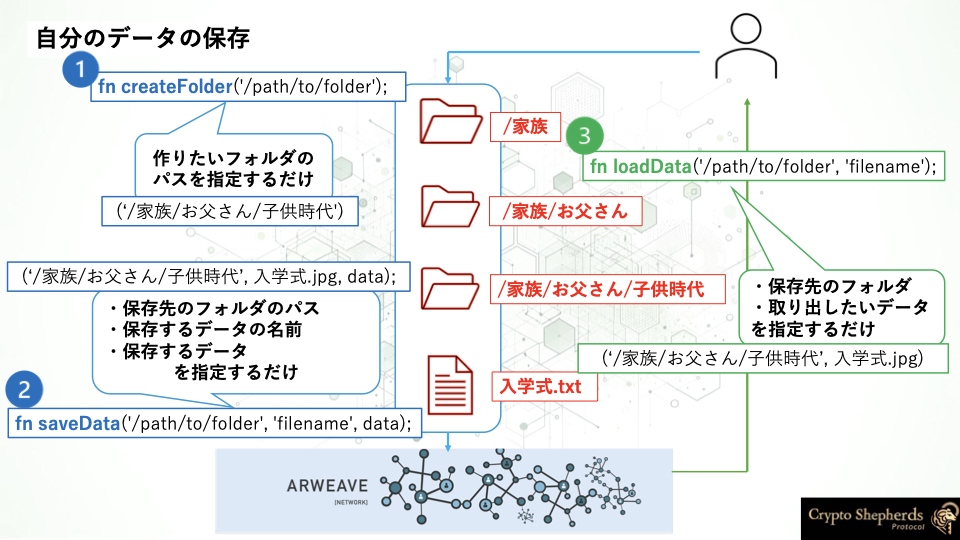

# Hierarchical Encryption

## Basic Encryption

暗号化アルゴリズムのベースとなる暗号化キーには、公開鍵暗号化方式と共通鍵暗号化方式が使用されています。

- 公開鍵暗号化方式

    公開鍵ペアの秘密鍵は、データ所有者のマスターアクセス権として機能します。

    [ECIES](https://en.wikipedia.org/wiki/Integrated_Encryption_Scheme)標準の公開鍵暗号化方式が使用されています。

- 共通鍵暗号化方式

    共通鍵は、データ所有者のルートのフォルダに紐づいている`GLOBAL_KEY`, ルート配下の各フォルダに対応している`GROUP_KEY`, データそのものを暗号化する`DATA_KEY`に分けられ、`秘密鍵`⇨`GLOBAL_KEY`⇨`GROUP_KEY`⇨`DATA_KEY`の順で暗号化されることで、階層的な暗号化が実現されています。

    [AES-256-GCM](https://en.wikipedia.org/wiki/Advanced_Encryption_Standard)が使用されています。


## How it works

### 対称鍵（共通鍵）をベースとした階層的暗号化構造によるフォルダ構造


[For Developers](../introduction/for-developers.md)セクションで述べたように、CryptoShepherds Protocolでは、**単一のデータのアクセス制御だけで、それに紐づくすべてのデータを共有する**ことと、**分散型ストレージに暗号データを構造的に保存する**ことを両方実現することで、分散型のデータ制御のスケーラビリティを高めています。

これを実現するため、フォルダ構造は、対称鍵（共通鍵）をベースとした階層的暗号化構造によって実現されています。

### 基本的なコンセプト

基本的なコンセプトは、以下の2つを実現することです。

1. 対称鍵（共通鍵）により順次暗号化されたデータを分散型ストレージに保存する
2. 分散型ストレージに保存された暗号データを、順次取得することで、フォルダ構造に対応した暗号化キーを用いて復号する

これにより、フォルダ構造に対応した暗号化キーを用いて、分散型ストレージに対称鍵をベースとした暗号文によるフォルダ構造を作成することができます。




実際のCryptoShepherds Protocolのメソッドを対応させながら、ロジックを簡単に見ていきましょう。

`/家族/お父さん/子供時代`フォルダに、`入学式.jpg`というデータを保存するケースを考えます。

```javascript
createFolder('/家族/お父さん/子供時代');
```

```javascript
saveData('/家族/お父さん/子供時代', '入学式.jpg', data);
```

```javascript
loadData('/家族/お父さん/子供時代', '入学式.jpg');
```




この時、`/家族`フォルダには対応した`GLOBAL_KEY`が割り当てられ、`/家族/お父さん`フォルダには対応した`GROUP_KEY`が割り当てられ、`/家族/お父さん/子供時代`フォルダには対応した`GROUP_KEY`が割り当てられ、`入学式.jpg`データには対応した`DATA_KEY`が割り当てられます。

そして、マスターアクセス権としての公開鍵ペアの`公開鍵`から`公開鍵`⇨`GLOBAL_KEY`⇨`GROUP_KEY`⇨`DATA_KEY`の順で暗号化を行い、暗号化されたデータを分散型ストレージに保存します。


保存したデータを取得する際には、分散型ストレージに保存された暗号データを順次取得して、ルートの秘密鍵から`秘密鍵`⇨`GLOBAL_KEY`⇨`GROUP_KEY`⇨`DATA_KEY`の順で復号すれば、`入学式.jpg`データを取得することができます。


### 具体的なロジック

では、対称鍵（共通鍵）をベースとした階層的暗号化構造について、詳しく見ていきましょう。


#### フォルダ構造の例

※ 例では、説明のため、実際の実装を簡略化して説明しています。

例えば、４層のフォルダとそれに保存されるデータについて考えてみます。

`/a/b/c/d`フォルダを作成して、`d`フォルダの中に`data`を保存するケースを考えます。

対称鍵（共通鍵）をベースとした階層的暗号化構造では、フォルダに対しての暗号化キーの割り当てを行います。
具体的なプロセスとしては、入力されたファイルパスから、割り当てる暗号化キーを生成します。

まずは、`/a/b/c/d`を入力されたファイルパスとして、`/a/b/c/d`に対して割り当てる暗号化キーを生成します。

`/a` ⇨GLOBAL_KEY：Tags （name: “GLOBAL”, value: /a ）

`/a/b` ⇨GROUP_KEY：Tags （name: “GROUP”, value: /a/b ）

`/a/b/c` ⇨GROUP_KEY：Tags （name: “GROUP”, value: /a/b/c ）

`/a/b/c/d` ⇨GROUP_KEY：Tags （name: “GROUP”, value: /a/b/c/d ）

Dataに対しては、無条件に一つのデータに対して一つのDATA_KEYが割り当てられます。

ただし、データにはファイル名を命名する必要があります。ここでは、`fileA`とします。

`data` ⇨DATA_KEY：Tags （name: “DATA”, value: `fileA` ）

ルートのマスターアクセス権としての`公開鍵`からパス順に暗号化して、暗号文を生成します。

Enc(a;b)を鍵aを用いてbを暗号化すること、Dec(c;d)を鍵cを用いてdを復号することとします。


**全く新しいフォルダかどうか判定**

→`/a/b/c/d` について、`/a` 、`/a/b` 、`/a/b/c` 、`/a/b/c/d` に対応するtxIdが分散型ストレージ（Arweave）に存在するかどうか走査します。

1. `/a` が存在しない場合、それ以下の`/a/b` 、`/a/b/c` 、`/a/b/c/d` も存在しないので、`/a` 、`/a/b` 、`/a/b/c` 、`/a/b/c/d` の全てに関して暗号化キーを生成。
2. `/a` は存在するが、`/a/b` は存在しない場合、それ以下の`/a/b/c` 、`/a/b/c/d` も存在しない。`/a/b` 、`/a/b/c` 、`/a/b/c/d` に関して暗号化キーを生成。
ただし、暗号化キーの生成スタートが`/a/b` と`/`が二つ続いているので、GROUP_KEYからの生成である。
3. 以下同様にすることで、「全く新しいフォルダ」の存在を見つける。


**保存**

- **全く新しいフォルダに保存**

    全く新しいフォルダ`/a/b/c/d` に`data` (`fileA`)を保存する場合を考えます。

1. 「**全く新しいフォルダかどうか判定**」ロジックから、`/a/b/c/d` に対応するtxIdが存在しないことがわかる。
2. Enc(DATA_KEY(`fileA`);`data` (`fileA`)) → C(`data`)
    
    →arweaveに保存⇨txId（Tags: name: “RAW_DATA”, value: `fileA` ）
    
3. Enc(GROUP_KEY(`/a/b/c/d`);DATA_KEY( `fileA`)) → C(DATA_KEY( `fileA`))
    
    →arweaveに保存⇨txId（Tags: name: “DATA_KEY”, value: `fileA` ）
    
4. Enc(GROUP_KEY(`/a/b/c`);GROUP_KEY(`/a/b/c/d`)) → C(GROUP_KEY(`/a/b/c/d` ))
    
    →arweaveに保存⇨txId（Tags: name: “GROUP”, value: `/a/b/c/d` ）
    
5. Enc(GROUP_KEY(`/a/b`);GROUP_KEY(`/a/b/c`)) → C(GROUP_KEY(`/a/b/c`))
    
    →arweaveに保存⇨txId（Tags: name: “GROUP”, value: `/a/b/c` ）

6. Enc(GLOBAL_KEY(`/a`);GROUP_KEY(`/a/b`)) → C(GROUP_KEY(`/a/b`))
    
    →arweaveに保存⇨txId（Tags: name: “GROUP”, value: `/a/b` ）
    
7. Enc(`公開鍵`;GLOBAL_KEY(`/a`)) → C(GLOBAL_KEY(`/a`))
    
    →arweaveに保存⇨txId（Tags: name: “GLOBAL”, value: `/a` ）
    

`/a/b/c/d` フォルダが作成され、フォルダ `d` の中に、`data` (`fileA`)が保存された。

**既存のフォルダに保存**

`data` (`fileB`)を`/a/b/p` に保存する場合を考えます。(`/a/b` はすでに存在。配下の `p` は新規作成)

1. 「**全く新しいフォルダかどうか判定**」ロジックから、`/a/b/p` に対応するtxIdが存在しないことがわかる。
2. `/a/b` 配下の `p` フォルダを新規作成するために、`/a/b` の復号されたGROUP_KEYが必要。
    
    txId(Tags: name: “GLOBAL”, value: `/a` )でC(GLOBAL_KEY(`/a`))を取得
    
    Dec(`公開鍵` ;C(GLOBAL_KEY(`/a`)) → GLOBAL_KEY(`/a`))
    
    txId（Tags: name: “GROUP”, value: `/a/b` ）でC(GROUP_KEY(`/a/b`))を取得
    
    Dec(GLOBAL_KEY(`/a`) ;C(GROUP_KEY(`/a/b`))) → GROUP_KEY(`/a/b`)
    
3. 「保存」の暗号化ロジックで暗号化して保存
    1. Enc(DATA_KEY( `fileB`);`data` (`fileB`)) → C(`data`)
        
        →arweaveに保存⇨txId（Tags: name: “RAW_DATA”, value: `fileB` ）
        
    2. Enc(GROUP_KEY(`/a/b/p`);DATA_KEY( `fileB`)) → C(DATA_KEY( `fileB`))
        
        →arweaveに保存⇨txId（Tags: name: “DATA_KEY”, value: `fileB` ）
        
    3. Enc(GROUP_KEY(`/a/b`);GROUP_KEY(`/a/b/p`)) → C(GROUP_KEY(`/a/b/p` ))
        
        →arweaveに保存⇨txId（Tags: name: “GROUP”, value: `/a/b/p` ）
        
4. GROUP_KEY(`/a/b`)より上の暗号化構造は変わらないから、GROUP_KEY(`/a/b`)を削除して終了。

`/a/b/p` フォルダが作成され、フォルダ `p` の中に、`data` (`fileB`)が保存された。

**取得**

`/a/b/p` の`data` (`fileB`)にアクセスしたいときを考えます。

1. txId(Tags: name: “GLOBAL”, value: `/a` )でC(GLOBAL_KEY(`/a`))を取得
    
    Dec(`秘密鍵` ;C(GLOBAL_KEY(`/a`)) → GLOBAL_KEY(`/a`))
    
2. txId（Tags: name: “GROUP”, value: `/a/b` ）でC(GROUP_KEY(`/a/b`))を取得
    
    Dec(GLOBAL_KEY(`/a`) ;C(GROUP_KEY(`/a/b`))) → GROUP_KEY(`/a/b`)
    
3. txId（Tags: name: “GROUP”, value: `/a/b/p` ）でC(GROUP_KEY(`/a/b/p`))を取得 
    
    Dec(GROUP_KEY(`/a/b`) ;C(GROUP_KEY(`/a/b/p`))) → GROUP_KEY(`/a/b/p`)
    
4. txId（Tags: name: “DATA_KEY”, value: `fileB` ）でC(DATA_KEY(`fileB`))を取得 
    
    Dec(GROUP_KEY(`/a/b/p`) ;C(DATA_KEY(`fileB`))) → DATA_KEY(`fileB`)
    
5. txId（Tags: name: “RAW_DATA”, value: `fileB` ）でC(`data`)を取得 
    
    Dec(DATA_KEY(`fileB`) ;C(`data`)) → `data` (`fileB`)
    

`data` (`fileB`)が返されればアクセスできる。
