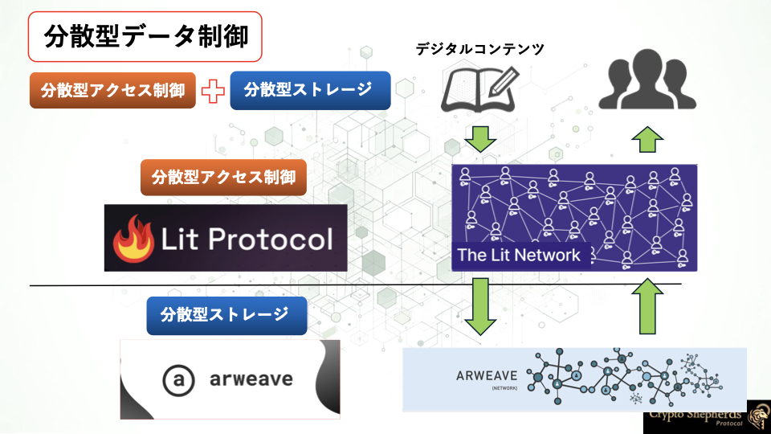
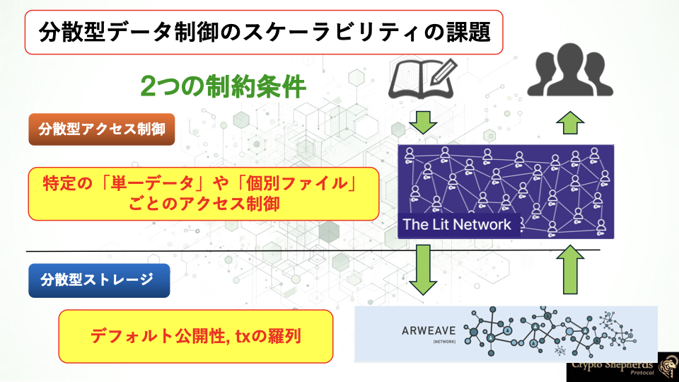

# For Developers

## なぜCryptoShepherds Protocolを使うのか

CryptoShepherds Protocolを利用することで、**スケーラブルに分散型のデータ制御を行える**ことが嬉しいです。

## 分散型のデータ制御

「分散型データ制御」とは、データのアクセス制御と保存を一箇所の中央サーバーで管理するのではなく、ネットワーク上に分散し、アクセスと管理を複数の信頼できるノード（参加者）によって分担して行う仕組みです。

つまり、分散型データ制御は、**アクセス制御**と**データ保存**をどちらも分散型で行うことで、データの**制御**を主権的に行うことができるデータ制御の方法です。

- **分散型アクセス制御**

    データへのアクセス権限を中央管理者を必要とせずに分散型ネットワーク上で条件に応じて管理する仕組み

- **分散型ストレージ**

    データを中央サーバーではなくネットワーク上の複数のノードに分散して保存することで、安全性・耐障害性を向上させる仕組み

## 現状の課題

現状の分散型のデータ制御には、スケーラビリティに関する大きな課題があります。

まず、現状の分散型アクセス制御には「単一データ」や「個別ファイル」ごとに対してしかアクセス制御を行うことができないという制約があります。[Lit Protocol](https://litprotocol.com/)などのプロジェクトでは、この制約を受けています。

さらに、分散型ストレージ（[Arweave](https://www.arweave.org/)など）のデフォルト公開性やネイティブでデータを構造的に保存できない性質から、暗号化やデータの構造化に配慮しながら保存を行う必要があります。

つまり、**単一のデータのアクセス制御だけで、それに紐づくすべてのデータを共有する**ことと、**分散型ストレージに暗号データを構造的に保存する**ことを両方実現することで、分散型のデータ制御のスケーラビリティを高める必要があります。

CryptoShepherds Protocolは、これらの課題を解決するために開発されたSDKです！

対称鍵ベースのフォルダ構造を作ったことにより、特定の対称鍵への分散型アクセス制御を行うだけで、その対称鍵に紐づけられた全データを共有できるようになったことが大きな特徴です。

CryptoShepherds Protocolでは、**スケーラブルな分散型のデータ制御**をアプリケーションの開発者にシンプルなメソッドで提供します！

CryptoShepherds Protocolでアプリケーション開発にどのような新しい価値を提供できるか、一緒に体験してみましょう！

- [**Key Features**](./key-features.md)

- [**Use Cases**](./use-cases.md)

