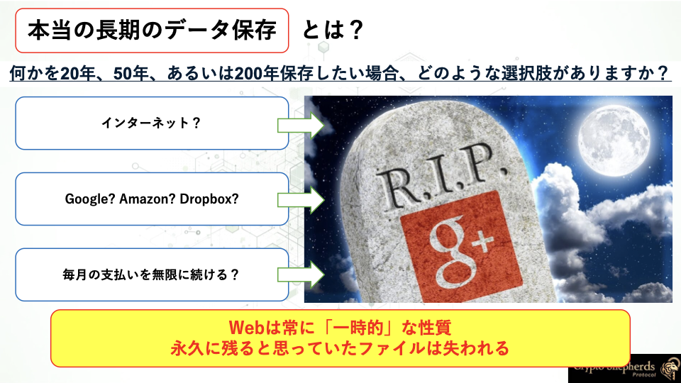
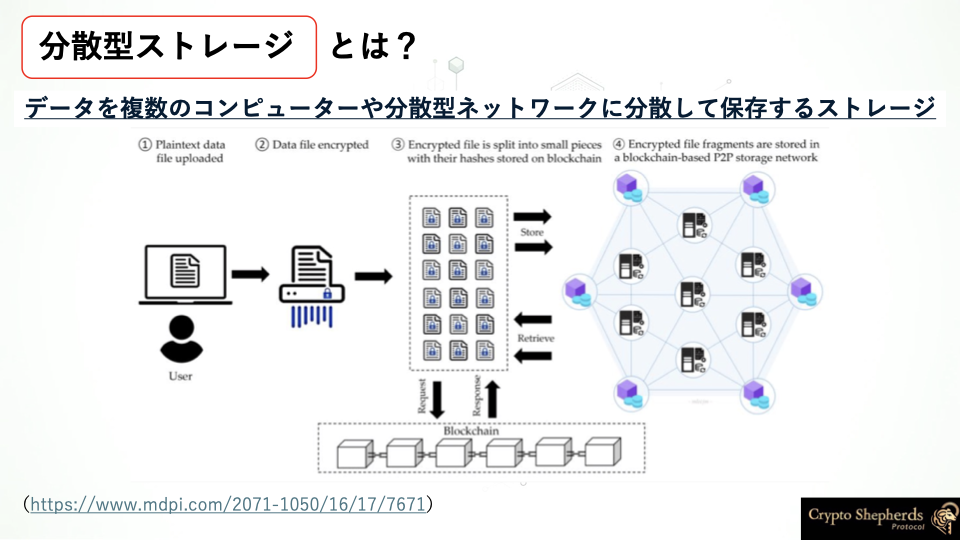
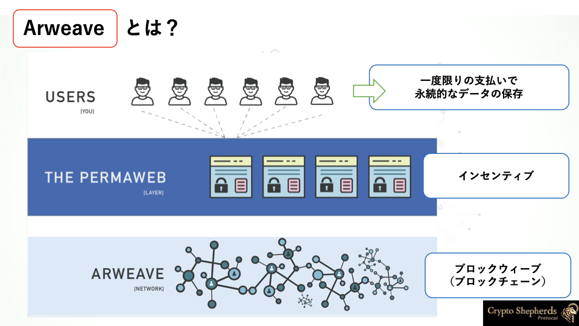
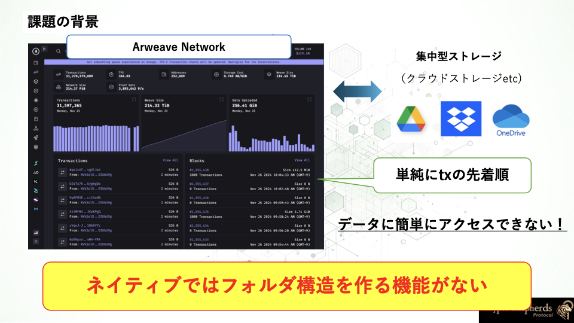
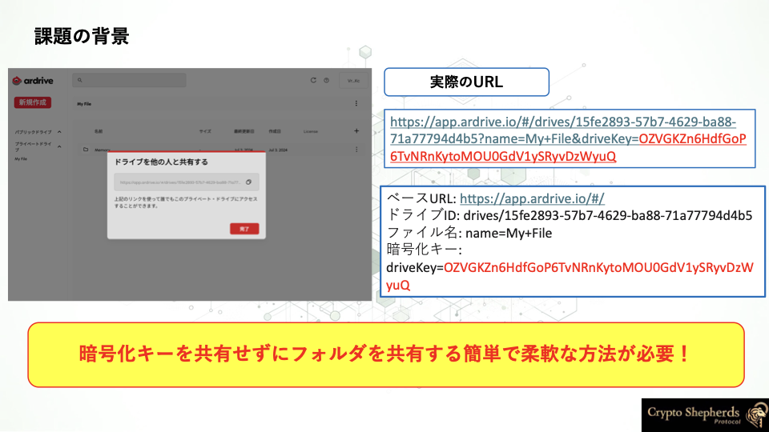

# For End Users

## CryptoShepherds Protocolの背景と目的

### 長期的なデータの保存にあなたは何を選びますか？

- **インターネット**
    
    長期的な情報収集の統計を見ると、わずか 2 年で、 Web 上に保存されたすべてのデータの 3 分の 1 が消失しています。
    
- **大企業**
    
    50 年後、あるいは来年にはどのような姿になっているでしょうか？Google+が閉鎖されたとき、彼らは閉鎖されたソーシャルメディアサイト上の古い投稿や写真をすべてバックアップしてから閉鎖したのでしょうか？もちろんそうしませんでした。Googleは他の企業と同様に、ポリシーを継続的に変更しています。
    
- **コスト**
    
    ストレージサービスの支払いを怠ったり忘れたりしたらどうなるでしょうか。クレジットカード情報を更新し忘れてメールアドレスが変わってしまったらどうなるでしょうか。情報はいつ削除されるのでしょうか。ユーザーが支払いをしていない場合、これらの企業は長期間にわたって情報を保管しておくことはありません。

### 長期的なデータの保存のソリューション

#### 分散型ストレージ

 長期的なデータの保存のソリューションの一つに分散型ストレージがあります。
 データを中央集権的なサーバーではなく、ネットワーク上の複数のノードに分散して保存する仕組みのことです。従来の集中型ストレージと異なり、単一障害点がなく、データの冗長性と可用性が高いという特徴があります。また、データの所有権をユーザー自身が保持できるため、データ主権の観点からも注目されています。

### Arweave

[Arweave](https://www.arweave.org/)は分散型ストレージのプロトコルです。
Arweaveネットワークは、データのためのビットコインのようなもので、公開された台帳の中にある永続的で分散型のウェブです。

重要なデータの保存から、真に分散型で証明可能に中立なウェブアプリのホスティングまで様々な用途で利用されています。

Arweaveでは、一度限りの支払いで、200年以上のデータの保存が可能です。

CryptoShepherds Protocolでは、Arweaveを利用してデータを保存します。

### 課題の背景

分散型ストレージのプロトコルであるArweaveは、データの保存と取得のためのAPIを提供しています。
しかし、ネイティブではフォルダ構造を作る機能がないため、データの整理が難しいです。
そのため、データを構造的に保存したいユーザーにとっては、分散型ストレージのプロトコルを直接利用することは難しいです。
また、デフォルト公開性を持つため、データのプライバシー性が低いという問題があります。
Arweaveで実行されるtxは[Arweave Explorer](https://viewblock.io/arweave)で誰でも閲覧可能です。

そこで、Arweaveを利用してデータを構造的に保存し、共有するためのプロトコルとして[ArDrive](https://ardrive.io/)を筆頭に、さまざまなプロトコルが普及しています。

ArDriveは、Arweaveのデータをフォルダ構造で整理し、ドライブの共有を可能にする現在最も普及しているプロトコルですが、その共有方法はURLによる共有であり、そのURLに暗号化キーを含める必要があります。

しかし、暗号化キーをURLに含めると、そのURLを知っている人はそのデータを閲覧できることになり、データのプライバシー性やセキュリティが低くなります。また、用途に応じたデータの共有が難しいという問題があります。

そこで、分散型ストレージにおける暗号化キーの共有不要なフォルダ共有ミドルウェアとして、CryptoShepherds Protocolが誕生しました！

CryptoShepherds Protocolでは、**シンプルなフォルダ構造**と**柔軟な復号条件を付与した暗号化キーの共有不要なフォルダ共有**を簡単に実現できます！

CryptoShepherds Protocolでエンドユーザーにどのような新しい価値を提供できるか、一緒に体験してみましょう！

- [**Key Features**](./key-features.md)

- [**Use Cases**](./use-cases.md)

