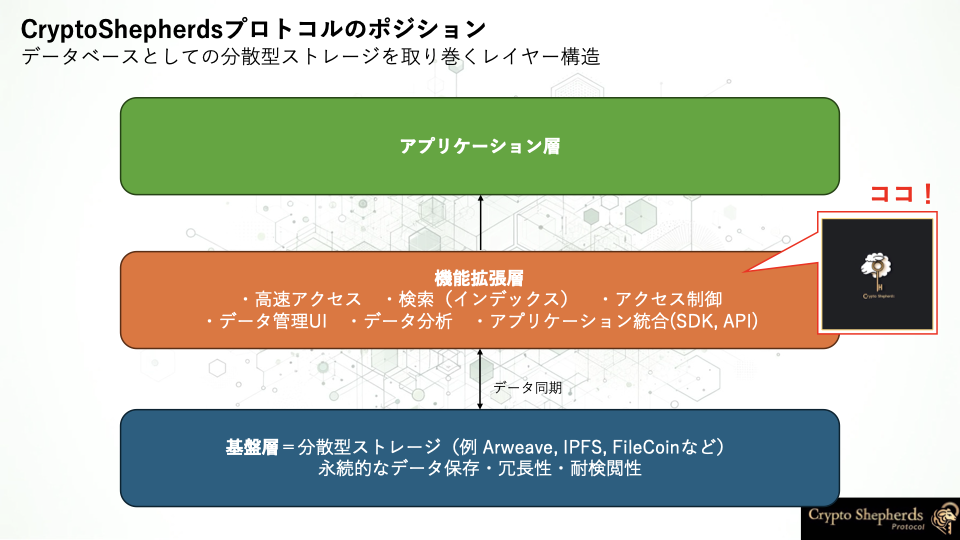
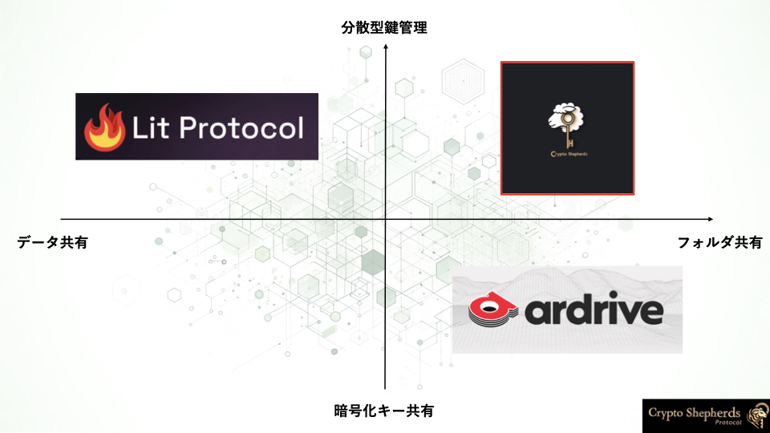

# Overview

**# We aim to make decentralized storage usable like Google Drive or Dropbox.**

## What is CryptoShepherds?
---

CryptoShepherds Protocolでは、分散型データ制御のスケーラビリティという課題に対し、フォルダ構造と暗号化キーの共有不要な分散型アクセス制御を統合したミドルウェアを開発しています。

開発者はライブラリを導入し、保存先フォルダと復号条件を設定するだけで、簡単かつ統合的にフォルダ構造付きデータ保存と分散型アクセス制御を利用可能です。

対称鍵ベースの階層的暗号化によりフォルダ構造を作成し、暗号化キーの共有を必要としない安全なフォルダ共有を実現します。

## Positioning
---

CryptoShepherds Protocolは、分散型ストレージの機能を拡張し、アプリケーションの可能性を広げるためのミドルウェアとして機能します。

## Comparison
---

他のプロジェクトと比較して、**分散型の鍵管理**と**フォルダの共有**という観点に関して、優位性を持っています。

## Background and purpose
---

CryptoShepherds Protocolは、以下の2つのユーザーに対して価値を提供します。

- [**For End Users**](./for-endusers.md)

- [**For Developers**](./for-developers.md)

